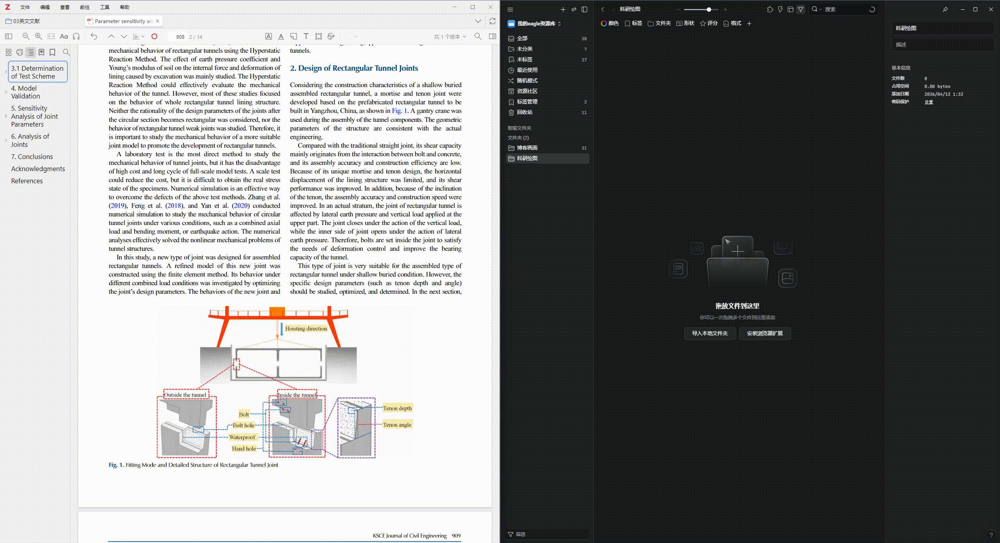
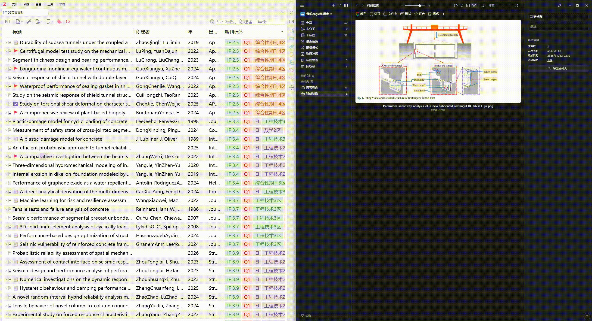

# Zotero2Eagle

<p align="center">
  
</p>

[](https://www.zotero.org) [](https://github.com/windingwind/zotero-plugin-template)

Zotero2Eagle 是一个面向 Zotero 9 的插件，用于将 PDF 图片标注导入 Eagle，并保留回到原文 PDF 的链接。

本项目基于 [yueneiqi/zotero2eagle](https://github.com/yueneiqi/zotero2eagle) 开发，感谢原作者的杰出工作。

## 功能

- 将 Zotero PDF 中的图片标注导入 Eagle
- 在 Eagle 中写入 `zotero://open-pdf/...` 回链
- 保存标题、作者、年份、页码、attachment key、annotation key
- 支持“新建图片标注后自动导入”
- 支持对所选图片标注、PDF 附件或顶层文献手动导出

## 演示

### 自动导入

.gif>)

在 Zotero PDF 中新建图片标注后，自动导入 Eagle。

### 手动导出



选中一个或多个图片标注，右键导出到 Eagle。

### 回链与自动标签



每条导入 Eagle 的条目都包含 `zotero://` 回链和自动生成的标签（标题、作者、年份、页码等）。

## 安装

### 开发环境加载

1. 在项目目录安装依赖：

```bash
npm ci
```

2. 配置 `.env`：

```env
ZOTERO_PLUGIN_ZOTERO_BIN_PATH=C:\\Program Files\\Zotero\\zotero.exe
ZOTERO_PLUGIN_PROFILE_PATH=C:\\Users\\你的用户名\\AppData\\Roaming\\Zotero\\Zotero\\Profiles\\你的开发profile
```

3. 启动开发模式：

```bash
npm start
```

### 手动安装打包产物

1. 构建插件：

```bash
npm run build
```

2. 使用 `zotero-plugin-scaffold` 的 release 流程生成 `.xpi`，或将构建后的 addon 用临时扩展方式加载到 Zotero 9。

## 配置

打开 `Preferences -> Zotero2Eagle`，填写：

- `Automatically import new image annotations into Eagle`
- `Eagle API URL`
- `Eagle API Token`
- `Eagle Folder ID`（可选）

## 使用

### 自动导入

1. 勾选 `Automatically import new image annotations into Eagle`
2. 在 Zotero 中打开 PDF
3. 新建一个图片标注
4. 插件会自动等待缓存图片生成并导入 Eagle

### 手动导出

在 PDF 阅读器中：

- 选中一个或多个图片标注
- 右键
- 点击 `Export Selected Image Annotations to Eagle`

## 验证

建议在单独的开发 profile 中验证。

1. 先确认 Eagle 已启动，插件设置中的 `Test Connection` 返回成功
2. 打开一篇带 PDF 的文献
3. 新建图片标注
4. 检查 Eagle 中是否出现新图片条目
5. 检查 Eagle 条目中是否包含：
   - `website` 回链
   - 标题、作者、年份、页码等 annotation 文本
   - 预期 tags
6. 点击 Eagle 中的 `website`，确认能跳回 Zotero PDF

注意：

- 本项目从 Zotero 侧调用的是 Eagle 本地 HTTP API
- 本地 HTTP API 的目标文件夹字段是 `folderId`
- Eagle Plugin API 中对应概念是 `folders`，两者不要混用

## 测试

```bash
npm run build
npm test
```

当前测试覆盖：

- Zotero 回链生成
- Eagle tags/annotation/文件名生成
- 插件实例与导出服务是否成功挂载

## 发布

- 当前版本：`v0.1.7`
- Release note：[GitHub Releases](https://github.com/LuckYang1/zotero2eagle/releases)

## 贡献

1. Fork 本仓库
2. 创建一个功能分支
3. 遵循 [DEVELOPMENT.md](DEVELOPMENT.md) 中的编码指南进行更改
4. 为新功能添加测试
5. 提交一个 Pull Request

## 许可证

本项目基于 AGPL 许可证授权 - 详情请参阅 [LICENSE](../LICENSE) 文件。

## 致谢

基于 [@windingwind](https://github.com/windingwind) 的 [Zotero 插件模板](https://github.com/windingwind/zotero-plugin-template) 构建。

[](https://github.com/windingwind/zotero-plugin-template)
